# 🏛️ DeaconCare

**A secure, infinite-scope middleware engine optimizing church-wide diaconal logistics and communication.**

DeaconCare is an invisible, zero-interface workflow platform designed to organize and coordinate church-wide service lanes according to historic biblical polity. By mapping all church activities into three universal operational cadences (Blocks, Series, and Fluid Pulses), the system scales fluidly across every square inch of church life. 

Whether a deacon or deaconess is managing Sunday childcare, prepping the Lord's Supper elements, executing audio/visual logistics, directing campus transit van routes, organizing a multi-week post-birth meal train, auditing mercy fund disbursements, or coordinating accessibility adjustments for members with physical limitations, the platform adapts to them. 

Volunteers fulfill their commitments entirely through their native phone habits (SMS & Voice Calls) while keeping sensitive pastoral data completely offline and private.

---

## 🌟 The Vision

Traditional church management tools create severe administrative friction, demanding that volunteers adopt complex applications, track usernames, and handle constant push notifications. In a vibrant, multi-generational congregation executing high-capacity relational care networks, this results in low system adoption, coordinator burnout, and a sterile, corporate approach to community mercy.

**DeaconCare flips this paradigm.** It treats software as a silent stagehand. The platform adapts completely to user habits. It utilizes lightweight automation to eliminate scheduling friction, protect human peace, and honor pastoral privacy.

---

## 🛡️ Core Philosophical Pillars

1. **The Invisible UI:** The entire user interface lives natively inside the volunteer's messaging or phone app. There are no corporate dashboards to browse or passwords to lose.
2. **Ecclesiastical Order:** Modeled tightly after historic church polity, structurally recognizing the unique boundaries of **Elders** (pastoral oversight), **Deacons/Deaconesses** (logistical shock absorbers), and **Covenant Members** (the serving body).
3. **Aggressive Data Blindness:** Features a zero-text-box input system for volunteers. It is technically impossible to save written prayer requests, medical status entries, or sensitive pastoral counseling notes inside the tracking database.
4. **The Grace Engine:** Powered by "Passive Assumption." If a busy volunteer forgets to log a completed task, the system assumes compliance out of love, silently closes the ticket, and purges all recipient PII at midnight.

---

## 🧱 The Unified System Stack

This diagram abstracts the entire platform into four universal layers. Look horizontally across any layer to see how high-level architectural constraints translate directly into real human service lanes.

```mermaid
graph TD
    %% Define the Layers as explicit structural steps
    subgraph L1 [🟢 LAYER 1: INTAKE & COMPLIANCE FILTERS]
        direction LR
        A_Tech["<b>Systems Architecture:</b><br>HTTPS Payload Validation & Background Status Filters"] 
        A_Hum["<b>Diaconal Application:</b><br>Childcare clearances, calendar setup for weddings & meal series"]
    end

    subgraph L2 [🟠 LAYER 2: THE COMMUNICATION PIPELINE]
        direction LR
        B_Tech["<b>Systems Architecture:</b><br>Twilio REST API Outbound/Inbound Request Gates"] 
        B_Hum["<b>Diaconal Application:</b><br>Roster claims for music/ushers; meal/wedding slot claims via 1-word SMS"]
    end

    subgraph L3 [🔵 LAYER 3: THE EXECUTION SANCTUARY]
        direction LR
        C_Tech["<b>Systems Architecture:</b><br>Row-Level Security / Dynamic Multi-Stop Route Engines"] 
        C_Hum["<b>Diaconal Application:</b><br>Face-to-face visits, safe driving, communion element prep, offline prayer"]
    end

    subgraph L4 [🔴 LAYER 4: THE LOG CLOSURE & PURGE]
        direction LR
        D_Tech["<b>Systems Architecture:</b><br>Asynchronous Bluetooth IVR Key-Tone Callback / PII Scrub"] 
        D_Hum["<b>Diaconal Application:</b><br>Hands-free steering wheel confirmation call while driving home"]
    end

    %% Vertical stack flow
    L1 --> L2 --> L3 --> L4

    %% High-Contrast Theme Styles
    style L1 fill:#fafafa,stroke:#2e7d32,stroke-width:2px,color:#1a1a1a
    style L2 fill:#fafafa,stroke:#ef6c00,stroke-width:2px,color:#1a1a1a
    style L3 fill:#fafafa,stroke:#0d47a1,stroke-width:2px,color:#1a1a1a
    style L4 fill:#fafafa,stroke:#c62828,stroke-width:2px,color:#1a1a1a

    style A_Tech fill:#ffffff,stroke:#2e7d32,stroke-width:2px,color:#1a1a1a
    style A_Hum fill:#ffffff,stroke:#2e7d32,stroke-width:2px,color:#1a1a1a
    style B_Tech fill:#ffffff,stroke:#ef6c00,stroke-width:2px,color:#1a1a1a
    style B_Hum fill:#ffffff,stroke:#ef6c00,stroke-width:2px,color:#1a1a1a
    style C_Tech fill:#ffffff,stroke:#0d47a1,stroke-width:2px,color:#1a1a1a
    style C_Hum fill:#ffffff,stroke:#0d47a1,stroke-width:2px,color:#1a1a1a
    style D_Tech fill:#ffffff,stroke:#c62828,stroke-width:2px,color:#1a1a1a
    style D_Hum fill:#ffffff,stroke:#c62828,stroke-width:2px,color:#1a1a1a
```



---

## 📋 Operational Cadence Matrix

The system maps infinite church needs into three core abstract behavioral engines:

### 🟢 1. The Block Cadence (Fixed Roster Operations)
* **CHBC Target Ministries:** Sunday Sound/AV, Music Teams, Ushers, Parking Lot, Sunday Childcare, Core Seminar Setups, Lord's Supper Prep, Baptismal Teams.
* **Systems Logic:** Time-buffered rotational slots. Evaluates background check stamps. Features an automated cascading alert chain: if a mission-critical team member has not checked into their slot by a specified cutoff time, the task auto-escalates to an on-call fallback deacon.
* **User Experience:** Team members confirm their weekly or monthly slots with a simple `ACK` text response.

### 🟠 2. The Series Cadence (Multi-Day Event Trains)
* **CHBC Target Ministries:** Post-Birth Meal Series, Wedding Deaconess Coordination, Funeral & Reception Teams, Member Assimilation Hubs, Post-Surgery Recoveries, Intensive Eldercare Rotations.
* **Systems Logic:** Generates a relational, multi-slot calendar grid tied to a singular family token. Obscures family identity details down to a proximity mask to prevent systemic data harvesting or accidental distribution.
* **User Experience:** Volunteers review open calendar slots via a text link and claim dates natively. The platform groups the coordination into a seamless, unified timeline.

### 🔵 3. The Fluid Pulse (On-Demand & Urgent Mercy)
* **CHBC Target Ministries:** Deacon of Accessibility (Urgent physical accommodations), Mercy Fund Allocation Approvals, Van Campus Rides, Personal Medical Appointments, Youth/College Event Transit, Urgent Hospital Visitations, Disaster Relief.
* **Systems Logic:** Dynamic geospatial route grouping for multi-stop transit lines. Automatically tracks active tasks during execution windows and triggers a hands-free Bluetooth phone callback upon vehicle power-down or time expiration.
* **User Experience:** Volunteers accept immediate dispatches via SMS, complete the task, and log a safe, private completion using steering-wheel key tones during their drive home. Personal addresses and contact cards are cryptographically scrubbed at midnight.

---

## ⚙️ Quick Start (Developer Setup)

Deploy the core backend engine locally in less than five minutes using these standard serverless commands:

```bash
# 1. Clone the repository
git clone https://github.com
cd deaconcare

# 2. Install secure environment dependencies
npm install dotenv twilio @supabase/supabase-js

# 3. Initialize local environment variables
cp .env.example .env
nano .env # Add your forced HTTPS URL, Supabase SSL Key, and Twilio Signature Token

# 4. Boot the serverless middleware engine locally
npm run dev
```

---

## 🔒 Security & Governance Compliance Checklist

* [ ] **Forced SSL/TLS 1.3:** Verify host edge networks completely block plain, unencrypted text payloads.
* [ ] **Supabase RLS Enabled:** Run row-level check queries to confirm tokens cannot pull unauthorized user tables.
* [ ] **Compliance Filters Active:** Ensure background verification hooks lock childcare rosters for profiles missing valid certification records.
* [ ] **24-Hour PII Scrub Verification:** Audit database transaction histories to ensure personal transportation addresses and contact cards are thoroughly cleared daily.

---

## 📖 Ecclesiastical & Technical Glossary

* **Background Guard:** A strict logic interceptor that filters database table inputs to guarantee compliance with local safe-church policies.
* **Covenant Filter:** The processing gateway that establishes a recipient's structural church relationship tier before checking dispatch rules.
* **Diaconate Ledger:** A cryptographically isolated state database tracking service rosters and logistical milestones without capturing typed written notes.
* **Grace Engine:** The asynchronous scheduling framework that defaults to silent task closure instead of repetitive automated warning pings.
* **Silent Sabbatical:** A profile property flag that hides a volunteer from rotational scheduling queues, protecting hurting or exhausted members from exposure.

---

License: MIT
